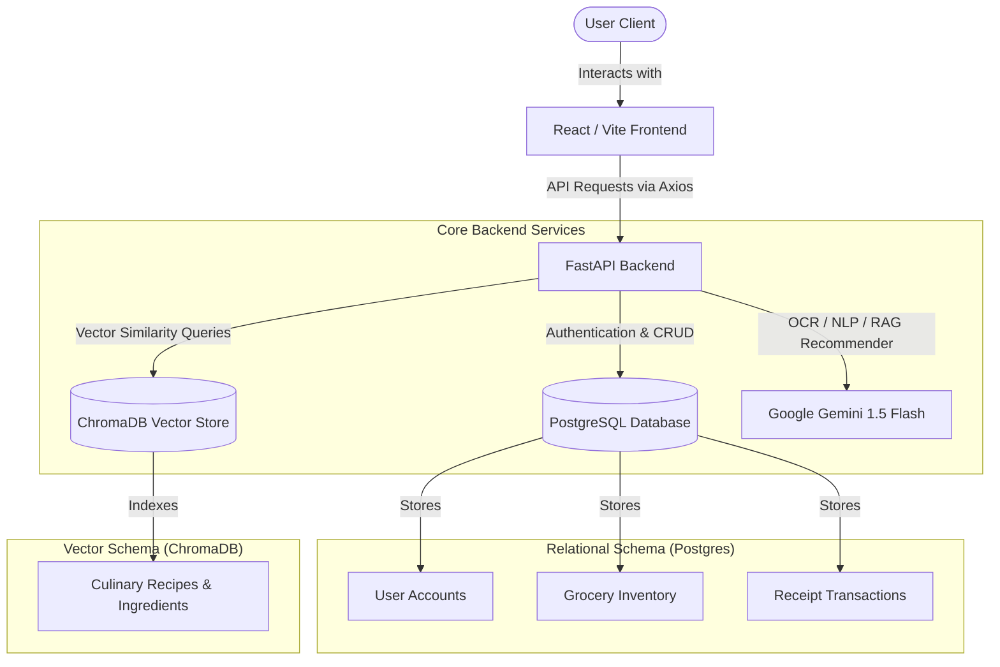

# 🍳 KitchenLens — Smart Home Food & Grocery Assistant

[](https://fastapi.tiangolo.com/)
[](https://react.dev/)
[](https://tailwindcss.com/)
[](https://aistudio.google.com/)
[](https://www.docker.com/)

**KitchenLens** is a modern, high-performance, and secure full-stack application designed to help users intelligently manage groceries, track food expiration, and reduce food waste using state-of-the-art AI. 

By combining **FastAPI**, **React (Vite + TypeScript)**, and the **Google Gemini 1.5 Flash** model with a hybrid search architecture (relational inventory metadata in **PostgreSQL** and vector recipe documents in **ChromaDB**), KitchenLens offers a seamless, premium smart kitchen companion.

---

## 📖 Table of Contents
1. [🚀 Key Features](#-key-features)
2. [📐 System Architecture](#-system-architecture)
3. [🛠️ Tech Stack](#️-tech-stack)
4. [🏃 How to Run Locally](#-how-to-run-locally)
   - [Option A: Quick Start with Docker (Recommended)](#option-a-quick-start-with-docker-recommended)
   - [Option B: Manual Standalone Setup](#option-b-manual-standalone-setup)
5. [📂 Directory Structure](#-directory-structure)
6. [🔐 Configuration & Environment Variables](#-configuration--environment-variables)
7. [🔧 Troubleshooting Guide](#-troubleshooting-guide)
8. [🚀 CI/CD & Deployment](#-cicd--deployment)
9. [⚖️ License](#️-license)

---

## 🚀 Key Features

*   **🥗 Zero Waste Mode**: Intelligently scan ingredients expiring within 3 days and automatically recommend recipes that leverage these items first.
*   **💬 Recipe RAG Assistant**: An advanced chatbot that answers "What can I cook tonight?" by querying your real-time inventory and finding matching recipes in a high-performance vector database.
*   **📸 Smart Receipt Scanner**: Upload grocery receipt images; Gemini 1.5 Flash Vision parses the items, calculates unit prices, assigns grocery categories, and registers them into your inventory automatically.
*   **🍎 Nutrition Summarizer**: Instantly scan or upload nutrition labels to receive clean, actionable visual health insights, warnings about allergens, and sugar/sodium alerts.
*   **📊 Inventory & Expiry Tracker**: A sleek dashboard tracking grocery levels, categories, and item statuses (Fresh, Expiring Soon, Expired) using high-impact visual indicators and charts.
*   **💰 Budget Summary**: Track monthly and weekly grocery spending by category (e.g., Produce, Dairy, Meat) and store, with dynamic spending analytics.

---

## 📐 System Architecture

KitchenLens leverages a hybrid database and AI orchestration engine. The diagram below illustrates how client interactions route to FastAPI and leverage both structured relational data and unstructured vector data:



---

## 🛠️ Tech Stack

| Layer | Component / Library | Purpose |
| :--- | :--- | :--- |
| **Frontend** | React 19, TypeScript, Vite 8 | Ultra-fast rendering, static typed application skeleton. |
| **Styling** | Tailwind CSS v4, Framer Motion | Modern design language, smooth layout transitions, fluid visual states. |
| **State & API** | TanStack Query (React Query) v5 | Robust server state sync, smart caching, automatic retries. |
| **Backend** | FastAPI, Python 3.11 | High-throughput async ASGI API web server. |
| **ORM** | SQLAlchemy 2.0, Alembic | SQL toolkit and migrations engine for database schemas. |
| **Vector DB** | ChromaDB 0.4.24 | Vector store optimized for high-dimensional recipe embedding search. |
| **Relational DB** | PostgreSQL 15 | Relational data persistence for users, receipts, and inventory. |
| **AI Orchestration**| Google Gemini 1.5 Flash, LangChain | RAG pipelines, Vision OCR parsing, and contextual recipe generation. |
| **Containerization**| Docker, Docker Compose | Microservice orchestration and repeatable local/production runs. |

---

## 🏃 How to Run Locally

### Option A: Quick Start with Docker (Recommended)

Make sure you have [Docker Desktop](https://www.docker.com/products/docker-desktop/) installed and running.

#### 1. Clone & Set Up Environments
Create a `.env` file at the **root** of the repository:
```env
PROJECT_NAME="KitchenLens"
SECRET_KEY="generate-a-long-random-string-here"
GOOGLE_API_KEY="AIzaSy...your-actual-google-gemini-api-key"

# Database Configuration (Docker-compose defaults)
POSTGRES_USER=postgres
POSTGRES_PASSWORD=postgres
POSTGRES_SERVER=db
POSTGRES_PORT=5432
POSTGRES_DB=kitchenlens

# Vector Database Configuration
CHROMA_HOST=chroma
CHROMA_PORT=8000
```
Also, copy this `.env` to the `backend/` directory so the backend container can access it directly during isolated builds.

#### 2. Spin Up Services
Run the following command at the root of the project:
```bash
docker compose up --build
```

#### 3. Access the Services
*   **Frontend Client**: [http://localhost:5173](http://localhost:5173)
*   **FastAPI Backend API**: [http://localhost:8000](http://localhost:8000)
*   **API Swagger Docs**: [http://localhost:8000/docs](http://localhost:8000/docs)
*   **ChromaDB Vector Store**: [http://localhost:8001](http://localhost:8001)

---

### Option B: Manual Standalone Setup

If you prefer to run the components independently on your host machine without Docker:

#### 1. Prerequisites
*   Python 3.11+
*   Node.js 20+
*   PostgreSQL running locally (create a database named `kitchenlens`)
*   ChromaDB running locally or set up in-memory

#### 2. Start the Backend API
1. Navigate to the backend directory:
   ```bash
   cd backend
   ```
2. Create and activate a Python virtual environment:
   ```bash
   python -m venv venv
   # On Windows (PowerShell):
   .\venv\Scripts\Activate.ps1
   # On macOS/Linux:
   source venv/bin/activate
   ```
3. Install dependencies:
   ```bash
   pip install -r requirements.txt
   ```
4. Configure local environment variables:
   Copy `.env.example` to `.env` and fill in your details:
   ```bash
   cp .env.example .env
   ```
   > [!IMPORTANT]
   > Make sure to update `POSTGRES_SERVER` to `localhost` and specify your local Postgres credentials inside `backend/.env`.
5. Start the FastAPI server:
   ```bash
   uvicorn app.main:app --reload --port 8000
   ```

#### 3. Start the Frontend Client
1. Open a new terminal tab and navigate to the frontend directory:
   ```bash
   cd frontend
   ```
2. Install npm packages:
   ```bash
   npm install
   ```
3. Set local environment configurations:
   By default, the client points to `http://localhost:8000/api/v1`. If you want to override it, create a `.env.local` file:
   ```env
   VITE_API_URL=http://localhost:8000/api/v1
   ```
4. Start the development server:
   ```bash
   npm run dev
   ```
5. Open your browser and navigate to [http://localhost:5173](http://localhost:5173).

---

## 📂 Directory Structure

Here is a map of the repository structure to help you get oriented:

```text
kitchenLens/
├── backend/                    # Python FastAPI Backend
│   ├── app/                    # Main application code
│   │   ├── core/               # App configuration, security, DB connections
│   │   ├── models/             # SQLAlchemy DB schemas (User, Grocery, Receipt)
│   │   ├── routes/             # FastAPI controllers / API endpoints
│   │   ├── schemas/            # Pydantic data validators
│   │   ├── services/           # Services (Gemini AI, Receipt Scanner, RAG/Chroma)
│   │   ├── tests/              # Pytest unit and integration test suite
│   │   └── main.py             # FastAPI entrypoint file
│   ├── chroma_data/            # Local vector database storage (ignored)
│   ├── .env.example            # Backend env template
│   ├── Dockerfile              # Containerization recipe for Backend
│   └── requirements.txt        # Python package dependencies
├── frontend/                   # React + Vite Web Application
│   ├── public/                 # Static public assets
│   ├── src/                    # Frontend source code
│   │   ├── api/                # Axios client configurations and API wrappers
│   │   ├── components/         # Shared visual UI layout and widgets
│   │   ├── context/            # Authentication and Global state contexts
│   │   ├── pages/              # Views (Dashboard, Inventory, Chat, Scanner)
│   │   ├── App.tsx             # Root page router
│   │   └── main.tsx            # Main application mounting point
│   ├── dist/                   # Production build distribution folder (ignored)
│   ├── Dockerfile              # Nginx web server container recipe
│   ├── package.json            # Node scripts and dependencies
│   ├── postcss.config.js       # PostCSS compiler config
│   ├── tailwind.config.js      # Tailwind CSS layout variables
│   └── vite.config.ts          # Vite build manager config
├── .github/
│   └── workflows/
│       └── ci-cd.yml           # CI/CD pipeline building, testing, and preparing ACA
├── docs/                       # Project guides
│   ├── api.md                  # API Schema references
│   ├── architecture.md         # Deep-dive architecture overview
│   └── deployment.md           # Step-by-step Azure Container Apps deployment guide
├── docker-compose.yml          # Container orchestration suite
├── .gitignore                  # Global untracked paths config
└── README.md                   # Primary project overview guide
```

---

## 🔐 Configuration & Environment Variables

| Variable Name | Description | Required? | Default |
| :--- | :--- | :--- | :--- |
| `GOOGLE_API_KEY` | Your Google Gemini API Key used for vision and text queries. | **Yes** | None |
| `SECRET_KEY` | Custom encryption string for password hashing & JWT tokens. | **Yes** | None |
| `POSTGRES_USER` | Admin user for the database. | No | `postgres` |
| `POSTGRES_PASSWORD` | Password for the database. | No | `postgres` |
| `POSTGRES_DB` | Name of the primary SQL schema. | No | `kitchenlens` |
| `POSTGRES_SERVER` | DB Host. Use `db` in Docker, `localhost` for manual setups. | No | `db` |
| `POSTGRES_PORT` | Port for the DB instance. | No | `5432` |
| `CHROMA_HOST` | Hostname of the Vector DB. Use `chroma` in Docker. | No | `chroma` |
| `CHROMA_PORT` | Container port of ChromaDB service. | No | `8000` |
| `VITE_API_URL` | Frontend URL pointing to backend API. | No | `http://localhost:8000/api/v1` |

---

## 🔧 Troubleshooting Guide

### 1. "ChromaDB port conflict / Container not starting"
*   **Cause**: Chroma runs on container port `8000`, which conflicts with the FastAPI server running on host port `8000` if both map to the same local port.
*   **Fix**: Ensure your `docker-compose.yml` maps Chroma externally to `8001:8000` while allowing the FastAPI backend (within the docker network) to contact Chroma on `http://chroma:8000`.

### 2. "Database connection refused"
*   **Cause**: The backend container starts before PostgreSQL is fully initialized.
*   **Fix**: `docker compose down -v` to purge corrupted locks, and run `docker compose up --build` again. The compose schema handles automatic restarts for service recovery.

### 3. "Gemini API Key Unauthorized"
*   **Cause**: The Gemini API key is missing or invalid.
*   **Fix**: Ensure you have loaded your key correctly in your `.env` file without leading/trailing quotes and that you have active quota in [Google AI Studio](https://aistudio.google.com/).

### 4. "CORS Error in Frontend"
*   **Cause**: Running the frontend manually on a port other than Vite's default or running a backend without CORS origin headers.
*   **Fix**: Check `backend/app/main.py` and ensure the list of allowed origins includes your host frontend URL (`http://localhost:5173`).

---

## 🚀 CI/CD & Deployment

This project contains a fully-fledged CI/CD configuration under `.github/workflows/ci-cd.yml` which automates:
1. Running backend tests with Pytest.
2. Checking code build status for both frontend and backend.
3. Deploying images to GitHub Container Registry (GHCR) and pushing them live to **Azure Container Apps (ACA)**.

For a comprehensive guide on setting up manual or automated cloud deployments, please refer to our **[Deployment Guide (docs/deployment.md)](file:///d:/repos/kitchenLens/docs/deployment.md)**.

---

## ⚖️ License

Distributed under the MIT License. See `LICENSE` for details.

---
*Developed and maintained by Antigravity AI Coding Assistant.*

